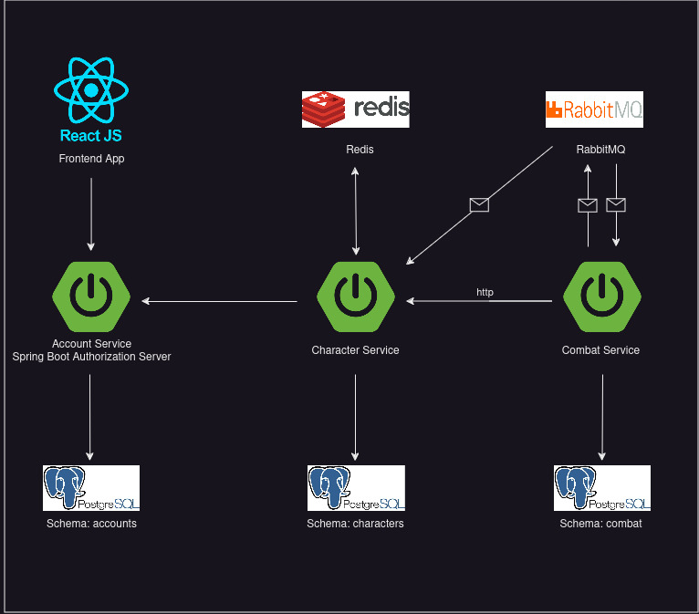

# MaxBet World of Gamecraft coding challenge for Milan Stojković

## Summary

In this project, we will develop a game system for a fictional RPG video game. In this game, players can
create characters and venture out into the world where they can get gear and fight other players. Because
the system needs to be scalable in order to support a large number of players, we have adopted a
microservice architecture. During the analysis process, the following services were identified:

1. Account Service
2. Character Service
3. Combat Service

## Techology

- Language: Java
- Framework: Spring Boot

### Project Schema:

<br>



---

The project is consists of three backend services, postgresql, redis, rabbitmq and frontend react app.

---

### React Frontend App

React Frontend App is single page React App used for easy obtaining JWT from <b>Account Service</b>.
Uses OAuth2 pkce Authorization code as public client to authenticate and get JWT.
To run <b>React Frontend App</b> as standalone app, follow the steps:

1. go to root folder, where package.json is located and run:

```shell script
npm install
```

2. After installation, run:

```shell script
npm run start
```

### Account Service

Account Service is <b>Spring boot Authorization server</b> responsible for User (Account) registration and
for issuing JWT. The other two services, Character and Combat, are <b>Spring boot resource servers</b> which use Account Service
for JWT validation.

### Character Service

Character Service stores information about Characters and Items. Redis is used for caching, and RabbitMQ for asynchronous
communication.

### Combat Service

Combat Service is responsible for Combat creation and management. When the user wants to start a Combat, it hits the endpoint with http request.
The steps that follow are:

1. Check if that two characters are free for fight - whether they are not participating in some Active Combat.
2. The Character service is called for all stats about that two Characters
3. With obtained stats, Combat object is created and saved into database wit combat status = Active
4. CombatStart event is emitted. After this point, Users can call attack/cast/heal endpoint
5. Consumer handles CombatStart event and register the terminator to Stop the Combat after 5 min if Combat is still Active
6. Users call attack/cast/heal endpoint
7. Checking if User is resource owner - whether he is participating in Combat and whether combat is still Active
8. CombatCommand event is emitted
9. Consumer handles CombatCommand event and register new / remove old flux publisher
   which emitted UpdateCombat events at every 1 (Attack) or 2 seconds (Cast, Heal)
10. Consumer handles UpdateCombat event, calculate the damage/heal, and update Combat object into database.
    If any Character loose all health - CombatStop event is emitted.
11. The Spring Cloud Function handle CombatStop event. Remove flux publisher and terminator, if exists. Update Combat status into Database to FINISHED.
    And emits the WinnerEvent.
12. WinnerEvent is handled by Character Service.
    According to results, Characters will be updated - one random Item will be transferred from looser to winner

## Building and running the project

### Prerequisites:

- maven - version 3.9.1
- docker - version 24
- docker-compose - version 1.29
- java - version 21

First, build the services using build.sh script:

```shell script
./build.sh
```

The docker-compose can be run with start.sh script. In this step, images will be created using appropriate Dockerfiles,
and containers will be spined. Important note: build.sh script must be runned before start.sh script.

```shell script
./start.sh
```

Finally, everything will be removed with stop.sh script:

```shell script
./stop.sh
```

---

## Test the project

1. Use Frontend React App to obtain JWT access token. It is running at http://localhost:3000.
2. Seeded users, which can be used for login are:

   | User          | Role        |
   | ------------- | ----------- |
   | master@wog.io | GAME_MASTER |
   | one@wog.io    | USER        |
   | two@wog.io    | USER        |

All of them have unique and very secure password: super_secret

3. With obtained token, user can access <b>Character Service</b>
4. The seeded Characters are:

   | Owner      | Character name | Character id                         |
   | ---------- | -------------- | ------------------------------------ |
   | one@wog.io | Karl Franz     | 995658ff-144b-4f19-979f-811aaa063641 |
   | two@wog.io | Bright Wizard  | d6608669-4332-4575-b8b1-5e3922ef4f12 |

5. Every Character has Items attached. For example, Karl Franz has mighty warhammer named 'Ghal Maraz'
6. Also, with tokens, Users can access <b>Combat Service</b> and start the fight

---

### Things to improve:

- Better handle the Exceptions
- Refactor Combat service
- Add Swagger docs for all endpoints
- Better cover the code with Tests

---
